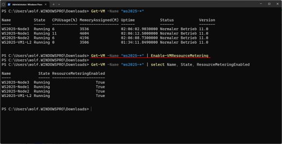
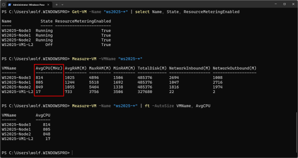
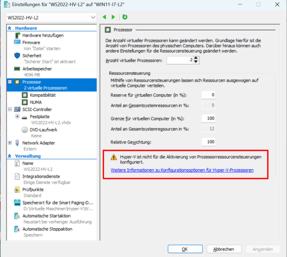

**Kumulierte Daten erfassen mit VM Resource Metering**

Eine weitere Quelle für Auslastungsdaten von virtuellen Maschinen existiert mit dem VM Resource Metering. Dieses aktiviert man pro VM und der Hypervisor erfasst dann kontinuierlich Nutzungsdaten, darunter solche für CPUs, RAM und Netzwerk.

Die Datensammlung lässt sich so aktivieren:

Get-VM -Name "ws2025-\*" \| Enable-VMResourceMetering

Dieses Beispiel aktiviert die Datenerfassung für alle VMs mit Windows Server 2025, die nach diesem Schema benannt sind. Den Erfolg der Operation kann man so prüfen:

Get-VM -Name "ws2025-\*" \| select Name, State, ResourceMeteringEnabled

*Resource Metering für mehrere virtuelle Maschinen aktivieren*

Ab diesem Zeitpunkt summiert Hyper-V die Werte für die verbrauchten Ressourcen auf und zeigt den Durchschnitt über den gesamten Beobachtungszeitraum an. Den aktuellen Stand kann man für unser Beispiel so ausgeben:

Measure-VM -VMName "ws2025-\*"

Wie man der Ausgabe entnehmen kann, wird die verbrauchte Rechenzeit in MHz angegeben. Wenn eine CPU zum Beispiel 8 Kerne hat und mit 2,4 GHz getaktet ist, dann entspricht das 19.200 MHz:

8 \* 2400 MHz = 19200 MHz

Durch SMT kommt eine Effizienzsteigerung hinzu, die Hyper-V wahrscheinlich bei der Berechnung der Gesamtkapazität einberechnet.

*Measure-VM zeigt den durchschnittlichen Verbrauch an Rechenleistung durch eine VM in MHz an.*

Wenn eine VM auf längere Frist wie in der obigen Abbildung 814 MHz verbraucht, dann wären das rund 4 Prozent der insgesamt verfügbaren Leistung.

Die Ergebnisse von VM Resource Metering eignen sich nicht nur zur Kalkulation des Verbrauchs gemessen an der Gesamtkapazität, sondern erlauben einen schnellen Vergleich zwischen den VMs. Bei Engpässen erkennt man hier schnell, welche Workloads übermäßig viele CPU-Zyklen konsumieren und möglicherweise auf einem anderen Host platziert werden sollten.

Die Datensammlung durch VM Resource Metering kann man so beenden:

Disable-VMResourceMetering -VMName "ws2025-\*"

**Virtuelle CPU für VMs konfigurieren**

Wenn man in den Eigenschaften einer virtuellen Maschine zum Abschnitt *Prozessor* wechselt, dann kann man ihr dort nicht eine bestimmte Zahl an vCPUs zuweisen. Vielmehr finden sich unter [Ressourcensteuerung](https://www.windowspro.de/wolfgang-sommergut/cpu-leistung-unter-hyper-v-mit-der-ressourcensteuerung-verteilen) gleich mehrere Einstellungen.

Allerdings greifen diese nur beim klassischen Scheduler, der noch unter älteren Versionen von Windows 10 und auf Windows Server vor 2016 zum Einsatz kam. Seit Windows Server 2019 ist der [Core Scheduler voreingestellt](https://learn.microsoft.com/en-us/windows-server/virtualization/hyper-v/manage/manage-hyper-v-scheduler-types#virtual-machine-cpu-resource-controls-and-the-root-scheduler) und auf Client-Systemen ist der Root-Scheduler seit Windows 10 1803 der Standard.

In beiden Fällen findet man daher im Hyper-V Manager den Hinweis *"Hyper-V ist nicht für die Prozessorressourcensteuerung konfiguriert"*. Aus diesem Grund beschränkt sich die Dimensionierung der Rechenleistung bei neueren Systemen auf die Zahl der zugewiesenen vCPUs.

*Die Scheduler in neueren Versionen von Hyper-V erlauben kein manuelles Tuning der CPU-Ressourcen.*

**Zusammenfassung**

Für eine optimale Auslastung von Hyper-V-Hosts spielt die Zuteilung von Rechenleistung an die virtuellen Maschinen eine wesentliche Rolle. Den tatsächlichen Bedarf der einzelnen Workloads kann man mit Hilfe der entsprechenden Leistungsindikatoren in Perfmon ermitteln.

Allerdings sollte man den CPU-Verbrauch von virtuellen Maschinen nicht isoliert betrachten, sondern nur im Kontext der gesamten Server-Auslastung. Andernfalls könnte man etwa bei einer unterdimensionierten VM auf eine Ressourcenknappheit schließen, obwohl der Host noch über freie Kapazitäten verfügt. Entsprechendes gilt für den umgekehrten Fall.

Neben der Leistungsüberwachung mit den zuständigen Countern bietet das VM Resource Metering Einblicke in den Verbrauch von Rechenleistung durch VMs. Aufgrund der kumulierten Daten eignet es sich besonders für eine längerfristige Beobachtung.

Sind für VMs Anpassungen bei der zugewiesenen Prozessorkapazität notwendig, dann beschränken sich diese bei Windows 11 und Server ab 2019 auf die Zahl der vCPUs. Die dort eingesetzten Scheduler unterstützen kein Tuning mittels Ressourcensteuerung mehr.
