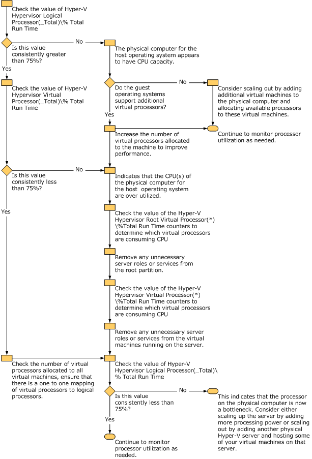

Prüfliste: Messen der Leistung in Hyper-V

-   01/06/2022

Während die meisten Prinzipien der Leistungsanalyse eines Gastbetriebssystems, das auf einem virtuellen Hyper-V-Computer installiert ist, mit der Analyse der Leistung eines Betriebssystems identisch sind, das auf einem physischen Computer installiert ist, unterscheiden sich viele der Erfassungsmethoden. Die folgenden Abschnitte sollten als Kurzreferenz verwendet werden, wenn Sie die Leistung Ihrer BizTalk Server-Lösung bewerten, die auf einem Gastbetriebssystem ausgeführt wird, das auf einem virtuellen Hyper-V-Computer installiert ist.

Messen der Festplatten-I/O-Leistung

Verwenden Sie die folgenden Leistungsindikatoren, um die Datenträger-E/A-Leistung auf einem Gastbetriebssystem zu messen, das auf einem virtuellen Hyper-V-Computer installiert ist:

| Schritt                                                                                                                                                                                                                                                                                                                                                                                                                                                                                                                                                                                                                                                                                                                                                                                                                                                                                                                                                                                                                                                                                                                                                                                                                                                                                                                                                                                                                                                                                                                                                                                                                                                                                                                                                                                                                                                                                                                                                                                                                                                                                                                                                                                                                                                                                                                                                                                                                                                                                                                                                                                                                                                                                                                                                                                                                                                                                                                                                                                                                                                                                                                                                                                                                                                                                                                                                                                                                                                                                                                                                             | Referenz                                                                                                                                                                                                                                                                                                                                                                                                                                                                                                                                                                                                                                                                                                                                                                                                                                                                                                                                       |
|---------------------------------------------------------------------------------------------------------------------------------------------------------------------------------------------------------------------------------------------------------------------------------------------------------------------------------------------------------------------------------------------------------------------------------------------------------------------------------------------------------------------------------------------------------------------------------------------------------------------------------------------------------------------------------------------------------------------------------------------------------------------------------------------------------------------------------------------------------------------------------------------------------------------------------------------------------------------------------------------------------------------------------------------------------------------------------------------------------------------------------------------------------------------------------------------------------------------------------------------------------------------------------------------------------------------------------------------------------------------------------------------------------------------------------------------------------------------------------------------------------------------------------------------------------------------------------------------------------------------------------------------------------------------------------------------------------------------------------------------------------------------------------------------------------------------------------------------------------------------------------------------------------------------------------------------------------------------------------------------------------------------------------------------------------------------------------------------------------------------------------------------------------------------------------------------------------------------------------------------------------------------------------------------------------------------------------------------------------------------------------------------------------------------------------------------------------------------------------------------------------------------------------------------------------------------------------------------------------------------------------------------------------------------------------------------------------------------------------------------------------------------------------------------------------------------------------------------------------------------------------------------------------------------------------------------------------------------------------------------------------------------------------------------------------------------------------------------------------------------------------------------------------------------------------------------------------------------------------------------------------------------------------------------------------------------------------------------------------------------------------------------------------------------------------------------------------------------------------------------------------------------------------------------------------------------|------------------------------------------------------------------------------------------------------------------------------------------------------------------------------------------------------------------------------------------------------------------------------------------------------------------------------------------------------------------------------------------------------------------------------------------------------------------------------------------------------------------------------------------------------------------------------------------------------------------------------------------------------------------------------------------------------------------------------------------------------------------------------------------------------------------------------------------------------------------------------------------------------------------------------------------------|
| Messen der Datenträgerlatenz auf einem Hyper-V-Hostbetriebssystem – Der beste erste Indikator für die Datenträgerleistung auf einem Hyper-V-Hostbetriebssystem wird mithilfe der Leistungsindikatoren "\\Logical Disk(*)\\Avg. Disk sec/Read" und "\\Logical Disk(\*)\\Avg. Disk sec/Write" ermittelt. Diese Leistungsindikatoren messen die Zeit, die Lese- und Schreibvorgänge benötigen, um auf das Betriebssystem zu reagieren. Als Faustregel gilt, dass durchschnittliche Reaktionszeiten von mehr als 15 ms als suboptimal angesehen werden. Als Faustregel gilt, dass durchschnittliche Reaktionszeiten von mehr als 15 ms als suboptimal angesehen werden. Dies basiert auf der typischen Suchzeit eines einzelnen Laufwerks mit 7200 U/min ohne Cache. Die Verwendung von Leistungsindikatoren für logische Datenträger im Vergleich zu physischen Datenträgern wird empfohlen, da Windows-Anwendungen und -Dienste logische Laufwerke verwenden, die als Laufwerkbuchstaben dargestellt werden, wobei der physische Datenträger (LUN), der dem Betriebssystem präsentiert wird, aus mehreren physischen Datenträgern in einem Datenträgerarray bestehen kann. Verwenden Sie die folgende Faustregel, wenn Sie die Datenträgerlatenz auf dem Hyper-V-Hostbetriebssystem mithilfe der Leistungsindikatoren \\Logischer Datenträger(\*)\\Durchschnittlicher Datenträger Sekunden/Lesen oder \\Logischer Datenträger(\*)\\Durchschnittlicher Datenträger Sekunden/Schreibvorgang messen:  Dies basiert auf der typischen Suchzeit eines einzelnen Laufwerks mit 7200 U/min ohne Cache. Die Verwendung von Leistungsindikatoren für logische Datenträger im Vergleich zu physischen Datenträgern wird empfohlen, da Windows-Anwendungen und -Dienste logische Laufwerke verwenden, die als Laufwerkbuchstaben dargestellt werden, wobei der physische Datenträger (LUN), der dem Betriebssystem präsentiert wird, aus mehreren physischen Datenträgern in einem Datenträgerarray bestehen kann. Verwenden Sie die folgende Faustregel, wenn Sie die Datenträgerlatenz auf dem Hyper-V-Hostbetriebssystem mithilfe der Leistungsindikatoren \\Logischer Datenträger(\*)\\Durchschnittlicher Datenträger Sekunden/Lesen oder \\Logischer Datenträger(\*)\\Durchschnittlicher Datenträger Sekunden/Schreibvorgänge messen:  - 1 ms bis 15 ms = Fehlerfrei – 15 ms bis 25 ms = Warnung oder Monitor – 26 ms oder höher = Kritisch, die Leistung wird beeinträchtigt \*\*Hinweis:*\* Physische Datenträger, die in einer nicht virtualisierten Umgebung installiert sind, bieten eine bessere Leistung als Datenträger, auf die über ein Hyper-V-Hostbetriebssystem zugegriffen wird. Wenn die Datenträgerleistung für die Gesamtleistung Ihrer Anwendung absolut entscheidend ist, sollten Sie in Erwägung ziehen, Datenträger nur auf physischer Hardware zu hosten.  Hinweis: Stellen Sie beim Auswerten der Datenträger-E/A-Leistung sicher, dass Sie die Antivirensoftware so konfigurieren, dass die Überprüfung von Festplattenpartitionen, die ausgewertet werden, ausgeschlossen wird. Antiviren-Scans verursachen einen Mehraufwand, der sich negativ auf die Leistung auswirken und die Testergebnisse verzerren kann.  Messen der Datenträgerlatenz auf Gastbetriebssystemen: Die Antwortzeiten der Datenträger, die von den Gastbetriebssystemen verwendet werden, können mit denselben Leistungsindikatoren gemessen werden, die zum Messen der Antwortzeiten der Datenträger verwendet werden, die vom Hyper-V-Hostbetriebssystem verwendet werden. | Weitere Informationen zur Analyse der Datenträgerleistung finden Sie in den folgenden Ressourcen:  - Abschnitt "Leistungsaufwand beim Ausführen von SQL Server in Hyper-V" im [Whitepaper "Ausführen von SQL Server 2008 in einer Hyper-V-Umgebung – Bewährte Methoden und Leistungsüberlegungen"](https://go.microsoft.com/fwlink/?LinkId=144622) - [Ausschließen von datenträgergebundenen Problemen](https://go.microsoft.com/fwlink/?LinkId=120947) - Bewährte Methoden für [SQL Server-E/A-Vorgänge vor der Bereitstellung](https://seniordba.wordpress.com/2016/04/19/sql-server-io-best-practice/) - "E/A-Engpässe" im Abschnitt [Whitepaper "Problembehandlung bei Leistungsproblemen in SQL Server 2008"](https://go.microsoft.com/fwlink/?LinkID=202135) – [Identifizieren eines Engpasses bei der Datenträgerleistung mithilfe des Microsoft Server Performance Advisor (SPA)-Tools](https://go.microsoft.com/fwlink/?LinkID=98096) |

Messen der Speicherleistung

Verwenden Sie die folgenden Leistungsindikatoren, um die Auswirkungen des verfügbaren Arbeitsspeichers auf die Leistung eines Gastbetriebssystems zu messen, das auf einem virtuellen Hyper-V-Computer installiert ist:

| Schritt                                                                                                                                                                                                                                                                                                                                                                                                                                                                                                                                                                                                                                                                                                                                                                                                                                                                                                                                                                                                                                                                                                                                                                                                                                                                                                                                                                                                                                                                                                                                                                                                                                                                                                                                                                                                                                                                                                                                                                                                                                                                                                                                                                                                                                                             | Referenz                                                                                                                                                                                                                                                                   |
|---------------------------------------------------------------------------------------------------------------------------------------------------------------------------------------------------------------------------------------------------------------------------------------------------------------------------------------------------------------------------------------------------------------------------------------------------------------------------------------------------------------------------------------------------------------------------------------------------------------------------------------------------------------------------------------------------------------------------------------------------------------------------------------------------------------------------------------------------------------------------------------------------------------------------------------------------------------------------------------------------------------------------------------------------------------------------------------------------------------------------------------------------------------------------------------------------------------------------------------------------------------------------------------------------------------------------------------------------------------------------------------------------------------------------------------------------------------------------------------------------------------------------------------------------------------------------------------------------------------------------------------------------------------------------------------------------------------------------------------------------------------------------------------------------------------------------------------------------------------------------------------------------------------------------------------------------------------------------------------------------------------------------------------------------------------------------------------------------------------------------------------------------------------------------------------------------------------------------------------------------------------------|----------------------------------------------------------------------------------------------------------------------------------------------------------------------------------------------------------------------------------------------------------------------------|
| Messen des verfügbaren Arbeitsspeichers auf dem Hyper-V-Hostbetriebssystem – Die Menge an physischem Arbeitsspeicher, die dem Hyper-V-Hostbetriebssystem zur Verfügung steht, kann durch Überwachen des Leistungsindikators "\\Memory\\Available MBytes" auf dem physischen Computer bestimmt werden. Dieser Leistungsindikator meldet die Menge an freiem physischem Arbeitsspeicher, die dem Hostbetriebssystem zur Verfügung steht. Verwenden Sie die folgenden Faustregeln, wenn Sie den verfügbaren physischen Speicher auswerten, der dem Hostbetriebssystem zur Verfügung steht:   \\Memory\\Available MBytes – Verfügbare MBytes misst die Menge an physischem Arbeitsspeicher, die für Prozesse verfügbar ist, die auf dem Computer ausgeführt werden, als Prozentsatz des auf dem Computer installierten physischen Speichers. Die folgenden Richtlinien gelten für das Messen des Werts dieses Leistungsindikators:   50 % des freien Speichers verfügbar oder mehr = Fehlerfrei 25 % des freien Speichers verfügbar = Monitor 10 % des freien Speichers verfügbar = Warnung Weniger als 5 % des freien Arbeitsspeichers verfügbar = Kritisch, die Leistung wird beeinträchtigt \\Memory\\Pages/sec – Dieser Leistungsindikator misst die Rate, mit der Seiten vom Datenträger gelesen oder auf den Datenträger geschrieben werden, um Fehler bei harten Seiten zu beheben. Um Fehler bei harten Seiten zu beheben, muss das Betriebssystem den Inhalt des Arbeitsspeichers auf den Datenträger auslagern, was sich negativ auf die Leistung auswirkt. Eine hohe Anzahl von Seiten pro Sekunde in Korrelation mit einem geringen verfügbaren physischen Speicher kann auf einen Mangel an physischem Speicher hinweisen. Die folgenden Richtlinien gelten für das Messen des Werts dieses Leistungsindikators:   Weniger als 500 = Gesund 500 - 1000 = Überwachung oder Vorsicht Größer als 1000 = Kritisch, die Leistung wird beeinträchtigt  Messen des verfügbaren Arbeitsspeichers auf dem Gastbetriebssystem – Der Arbeitsspeicher, der den Gastbetriebssystemen zur Verfügung steht, kann mit denselben Leistungsindikatoren gemessen werden, die zum Messen des für das Hyper-V-Hostbetriebssystem verfügbaren Arbeitsspeichers verwendet werden. | Weitere Informationen zu den Auswirkungen des verfügbaren physischen Arbeitsspeichers auf die Leistung von Anwendungsservern finden Sie im [Exchange Server 2003-Artikel "Ausschließen von speichergebundenen Problemen".](https://go.microsoft.com/fwlink/?LinkId=121056) |

Messung der Netzwerkleistung

Hyper-V ermöglicht es Gastcomputern, denselben physischen Netzwerkadapter gemeinsam zu nutzen. Dies hilft zwar bei der Konsolidierung der Hardware, aber achten Sie darauf, den physischen Adapter nicht zu überlasten. Verwenden Sie die folgenden Methoden, um die Integrität des Netzwerks sicherzustellen, das von den virtuellen Hyper-V-Computern verwendet wird:

| Schritt                                                          | Referenz                                                                                                                                                                                                                                                                                                                                                                                                                                                                                                                                                                                                                                                                                                                                                                                                                                                                                                                                                                                                                                                                                                                                                                                                                                                                                                                                                                                                                                                                                                                                                                                                                                                                                                                                                                                                                                                                                                                                                                                                                                                                     |
|------------------------------------------------------------------|------------------------------------------------------------------------------------------------------------------------------------------------------------------------------------------------------------------------------------------------------------------------------------------------------------------------------------------------------------------------------------------------------------------------------------------------------------------------------------------------------------------------------------------------------------------------------------------------------------------------------------------------------------------------------------------------------------------------------------------------------------------------------------------------------------------------------------------------------------------------------------------------------------------------------------------------------------------------------------------------------------------------------------------------------------------------------------------------------------------------------------------------------------------------------------------------------------------------------------------------------------------------------------------------------------------------------------------------------------------------------------------------------------------------------------------------------------------------------------------------------------------------------------------------------------------------------------------------------------------------------------------------------------------------------------------------------------------------------------------------------------------------------------------------------------------------------------------------------------------------------------------------------------------------------------------------------------------------------------------------------------------------------------------------------------------------------|
| Testen der Netzwerklatenz                                        | Pingen Sie jeden virtuellen Computer, um eine angemessene Netzwerklatenz sicherzustellen. In lokalen Netzwerken können Sie mit Reaktionszeiten von weniger als 1 ms rechnen.                                                                                                                                                                                                                                                                                                                                                                                                                                                                                                                                                                                                                                                                                                                                                                                                                                                                                                                                                                                                                                                                                                                                                                                                                                                                                                                                                                                                                                                                                                                                                                                                                                                                                                                                                                                                                                                                                                 |
| Test auf Paketverlust                                            | Verwenden Sie das Dienstprogramm pathping.exe, um den Paketverlust zwischen virtuellen Maschinen zu testen. Pathping.exe misst den Paketverlust im Netzwerk und ist mit allen Windows-Versionen seit Windows 2000 Server verfügbar. Pathping.exe sendet einen Burst von 100 Ping-Anfragen an jeden Netzwerkknoten und berechnet, wie viele Pings zurückgegeben werden. In lokalen Netzwerken sollte es keinen Verlust von Ping-Anfragen vom pathping.exe-Dienstprogramm geben.                                                                                                                                                                                                                                                                                                                                                                                                                                                                                                                                                                                                                                                                                                                                                                                                                                                                                                                                                                                                                                                                                                                                                                                                                                                                                                                                                                                                                                                                                                                                                                                               |
| Testen von Netzwerk-Dateiübertragungen                           | Kopieren Sie eine 100-MB-Datei zwischen virtuellen Maschinen und messen Sie die Zeit, die zum Abschließen des Kopiervorgangs erforderlich ist. In einem fehlerfreien Netzwerk mit 100 Mbit (Megabit) sollte eine 100 MB (Megabyte) große Datei in 10 bis 20 Sekunden kopiert werden. In einem fehlerfreien 1-Gbit-Netzwerk sollte eine 100-MB-Datei in etwa 3 bis 5 Sekunden kopiert werden. Kopierzeiten außerhalb dieser Parameter weisen auf ein Netzwerkproblem hin. Eine häufige Ursache für schlechte Netzwerkübertragungen tritt auf, wenn der Netzwerkadapter ein 10-MB-Halbduplex-Netzwerk "automatisch erkannt" hat, wodurch der Netzwerkadapter die verfügbare Bandbreite nicht voll ausnutzen kann.                                                                                                                                                                                                                                                                                                                                                                                                                                                                                                                                                                                                                                                                                                                                                                                                                                                                                                                                                                                                                                                                                                                                                                                                                                                                                                                                                              |
| Messen der Netzwerkauslastung auf dem Hyper-V-Hostbetriebssystem | Verwenden Sie die folgenden Leistungsindikatoren, um die Netzwerkauslastung auf dem Hyper-V-Hostbetriebssystem zu messen:  \\Netzwerkschnittstelle (\*)\\Bytes insgesamt/s – Der Prozentsatz der Netzwerkauslastung wird berechnet, indem Bytes insgesamt/s mit 8 multipliziert wird, um ihn in Bits umzuwandeln, das Ergebnis mit 100 multipliziert und dann durch die aktuelle Bandbreite des Netzwerkadapters dividiert wird. Verwenden Sie die folgenden Schwellenwerte, um die Auslastung der Netzwerkbandbreite auszuwerten:  - Weniger als 40 % der verwendeten Schnittstelle = fehlerfrei - 41 % bis 64 % der verwendeten Schnittstelle = Überwachung oder Vorsicht - 65 bis 100 % der verwendeten Schnittstelle = Kritisch, die Leistung wird beeinträchtigt  \\Netzwerkschnittstelle (\*)\\Länge der Ausgabewarteschlange – Die Länge der Ausgabewarteschlange misst die Anzahl der Threads, die auf den Netzwerkadapter warten. Wenn mehr als 2 Threads auf dem Netzwerkadapter warten, kann das Netzwerk ein Engpass sein. Häufige Ursachen dafür sind eine schlechte Netzwerklatenz und/oder hohe Kollisionsraten im Netzwerk. Verwenden Sie die folgenden Schwellenwerte, um die Länge der Ausgabewarteschlange auszuwerten:  - 0 = Fehlerfrei - 1-2 = Überwachen oder Vorsicht - Größer als 2 = Kritisch, die Leistung wird beeinträchtigt.  Stellen Sie sicher, dass die Netzwerkadapter für alle Computer (physisch und virtuell) in der Lösung so konfiguriert sind, dass sie denselben Wert für die maximale Übertragungseinheit (MTU) verwenden. Weitere Informationen zum Konfigurieren des MTU-Werts finden Sie unter [Anhang A: TCP/IP-Konfigurationsparameter](https://go.microsoft.com/fwlink/?LinkId=113716).  Wenn eine Länge der Ausgabewarteschlange von 2 oder mehr gemessen wird, sollten Sie dem physischen Computer, auf dem die virtuellen Computer gehostet werden, einen oder mehrere physische Netzwerkadapter hinzufügen, und die von den Gastbetriebssystemen verwendeten Netzwerkadapter an diese physischen Netzwerkadapter binden. |
| Messen der Netzwerkauslastung auf den Gastbetriebssystemen       | Wenn ein Netzwerkadapter auf der Hyper-V-Stammpartition ausgelastet ist, wie in den oben genannten Leistungsindikatoren des Systemmonitors angegeben, sollten Sie den Leistungsindikator "\\Hyper-V Virtual Network Adapter(\*)\\Bytes/sec" verwenden, um zu ermitteln, welche virtuellen Netzwerkadapter die meiste Netzwerkauslastung aufweisen.                                                                                                                                                                                                                                                                                                                                                                                                                                                                                                                                                                                                                                                                                                                                                                                                                                                                                                                                                                                                                                                                                                                                                                                                                                                                                                                                                                                                                                                                                                                                                                                                                                                                                                                           |

Weitere Informationen zur Analyse der Netzwerkleistung finden Sie unter [Chapter 15 - Measuring the .NET Application Performance](https://go.microsoft.com/fwlink/?LinkId=121073).

Messen der Prozessorleistung

Verwenden Sie die folgenden Methoden, um die Prozessorleistung auf einem Gastbetriebssystem auszuwerten, das auf einem virtuellen Hyper-V-Computer installiert ist:

-   Messen der Prozessorauslastung des Gastbetriebssystems - Traditionell kann die Prozessorleistung mithilfe des Leistungsindikators "\\Processor(\*)\\% Prozessorzeit" gemessen werden. Dies ist jedoch kein genauer Indikator für die Auswertung der Prozessorauslastung eines Gastbetriebssystems, da Hyper-V diesen Wert relativ zur Anzahl der Prozessoren misst und meldet, die dem virtuellen Computer zugeordnet sind. Wenn ausgeführten virtuellen Computern mehr Prozessoren zugeordnet sind, als tatsächlich auf dem physischen Computer vorhanden sind, ist der Wert, der von jedem Gastbetriebssystem für den Leistungsindikator "\\Processor(\*)\\% Processor Time" zurückgegeben wird, niedrig, auch wenn die Prozessorauslastung tatsächlich einen Engpass darstellt. Dies liegt daran, dass die virtuellen Prozessoren die physischen Prozessoren im Round-Robin-Verfahren verwenden. Jeder virtuelle Prozessor versucht, sich selbst einen Anteil an den gesamten Systemressourcen zuzuweisen, so dass in einem System mit 4 physischen Prozessoren jeder virtuelle Prozessor standardmäßig versucht, 25 % der Systemressourcen zu nutzen. Wenn 8 virtuelle Prozessoren erstellt werden, bedeutet dies, dass die virtuellen Prozessoren zusammen versuchen, 200 % der CPU-Kapazität des Servers zu nutzen. In diesem Fall meldet jeder virtuelle Prozessor eine geringe Auslastung, die mit dem Leistungsindikator "\\Processor(\*)\\% Prozessorzeit" gemessen wird (relativ zu der erwarteten Stufe), und der übermäßige Kontextwechsel zwischen den virtuellen Prozessoren führt zu einer schlechten Leistung für jeden virtuellen Computer. In diesem Szenario sollten Sie die Anzahl der virtuellen Prozessoren reduzieren, die virtuellen Hyper-V-Computern auf dem Hostbetriebssystem zugeordnet sind. Hyper-V stellt Hypervisor-Leistungsobjekte bereit, um die Leistung von logischen und virtuellen Prozessoren zu überwachen. Ein logischer Prozessor korreliert direkt mit der Anzahl der Prozessoren oder Kerne, die auf dem physischen Computer installiert sind. Beispielsweise würden 2 Quad-Core-Prozessoren, die auf dem physischen Computer installiert sind, mit 8 logischen Prozessoren korrelieren. Virtuelle Prozessoren sind das, was die virtuellen Maschinen tatsächlich verwenden, und die gesamte Ausführung in den Stamm- und untergeordneten Partitionen erfolgt in virtuellen Prozessoren.

Hyper-V stellt Hypervisor-Leistungsobjekte bereit, um die Leistung von logischen und virtuellen Prozessoren zu überwachen. Ein logischer Prozessor korreliert direkt mit der Anzahl der Prozessoren oder Kerne, die auf dem physischen Computer installiert sind. Beispielsweise würden 2 Quad-Core-Prozessoren, die auf dem physischen Computer installiert sind, mit 8 logischen Prozessoren korrelieren. Virtuelle Prozessoren sind das, was die virtuellen Maschinen tatsächlich verwenden, und die gesamte Ausführung in den Stamm- und untergeordneten Partitionen erfolgt in virtuellen Prozessoren.

Um die Prozessorauslastung eines Gastbetriebssystems genau zu messen, verwenden Sie den Leistungsindikator "Hyper-V Hypervisor Logical Processor(_Total)% Total Run Time" auf dem Hyper-V-Hostbetriebssystem. Verwenden Sie die folgenden Schwellenwerte, um die Prozessorauslastung des Gastbetriebssystems mithilfe des Leistungsindikators "Hyper-V Hypervisor Logical Processor(_Total)% Total Run Time" auszuwerten:

-   Weniger als 60% konsumiert = Gesund
    -   60 % - 89 % verbraucht = Überwachung oder Vorsicht
    -   90 % - 100 % verbraucht = Kritisch, die Leistung wird beeinträchtigt

Um Probleme mit der Prozessorleistung von Gastbetriebssystemen in einer Hyper-V-Umgebung zu beheben, empfiehlt es sich, ein Gleichgewicht zwischen den Werten anzustreben, die vom Hostbetriebssystem für "\\Hyper-V Hypervisor Logical Processor(_Total)\\% Total Run Time" (LPTR) und "\\Hyper-V Hypervisor Virtual Processor(_Total)\\% Total Run Time" (VPTR) gemeldet werden. Wenn LPTR hoch und VPTR niedrig ist, stellen Sie sicher, dass den virtuellen Maschinen nicht mehr Prozessoren zugewiesen sind, als physisch auf dem physischen Computer verfügbar sind. Verwenden Sie die Leistungsindikatoren "\\Hyper-V Hypervisor Virtual Processor(\*)\\%Guest Run Time", um zu bestimmen, welche virtuellen Prozessoren CPU verbrauchen, und heben Sie die Zuordnung virtueller Prozessoren zu virtuellen Computern auf, um eine Eins-zu-Eins-Zuordnung von virtuellen Prozessoren zu logischen Prozessoren zu konfigurieren. Weitere Informationen zum Konfigurieren einer Eins-zu-Eins-Zuordnung von virtuellen Prozessoren zu logischen Prozessoren finden Sie im Abschnitt "Optimieren der Prozessorleistung" in [Prüfliste: Optimieren der Leistung in Hyper-V](https://learn.microsoft.com/en-us/biztalk/technical-guides/checklist-optimizing-performance-on-hyper-v). Wenn VPTR hoch und LPTR niedrig ist, sollten Sie in Erwägung ziehen, virtuellen Maschinen zusätzliche Prozessoren zuzuweisen, wenn logische Prozessoren verfügbar sind und zusätzliche Prozessoren vom Gastbetriebssystem unterstützt werden. Wenn VPTR hoch und LPTR niedrig ist, logische Prozessoren zur Zuweisung verfügbar sind, aber zusätzliche Prozessoren vom Gastbetriebssystem nicht unterstützt werden, sollten Sie in Erwägung ziehen, horizontal zu skalieren, indem Sie dem physischen Computer zusätzliche virtuelle Computer hinzufügen und diesen virtuellen Computern verfügbare Prozessoren zuordnen. In dem Fall, in dem sowohl VPTR als auch LPTR hoch sind, überschreitet die Konfiguration die Grenzen des physischen Computers und sollte eine horizontale Skalierung in Betracht ziehen, indem der Umgebung ein weiterer physischer Computer und zusätzliche virtuelle Hyper-V-Computer hinzugefügt werden. Im folgenden Flussdiagramm wird der Prozess beschrieben, der bei der Problembehandlung der Prozessorleistung in einer Hyper-V-Umgebung verwendet werden sollte.

Wenn VPTR hoch und LPTR niedrig ist, sollten Sie in Erwägung ziehen, virtuellen Maschinen zusätzliche Prozessoren zuzuweisen, wenn logische Prozessoren verfügbar sind und zusätzliche Prozessoren vom Gastbetriebssystem unterstützt werden. Wenn VPTR hoch und LPTR niedrig ist, logische Prozessoren zur Zuweisung verfügbar sind, aber zusätzliche Prozessoren vom Gastbetriebssystem nicht unterstützt werden, sollten Sie in Erwägung ziehen, horizontal zu skalieren, indem Sie dem physischen Computer zusätzliche virtuelle Computer hinzufügen und diesen virtuellen Computern verfügbare Prozessoren zuordnen. In dem Fall, in dem sowohl VPTR als auch LPTR hoch sind, überschreitet die Konfiguration die Grenzen des physischen Computers und sollte eine horizontale Skalierung in Betracht ziehen, indem der Umgebung ein weiterer physischer Computer und zusätzliche virtuelle Hyper-V-Computer hinzugefügt werden. Im folgenden Flussdiagramm wird der Prozess beschrieben, der bei der Problembehandlung der Prozessorleistung in einer Hyper-V-Umgebung verwendet werden sollte.

 Problembehandlung bei der CPU-Leistung in einer Hyper-V-Umgebung

Anmerkung

Prozessoren des Gastbetriebssystems haben keine festgelegte Affinität zu physischen Prozessoren/Kernen – Der Hypervisor bestimmt, wie physische Ressourcen verwendet werden. Bei Prozessorauslastung plant der Hypervisor die Zeit des Gastprozessors in Form von Threads für den physischen Prozessor. Das bedeutet, dass die Prozessorlast virtueller Maschinen auf die Prozessoren des physischen Computers verteilt wird. Darüber hinaus dürfen virtuelle Maschinen die Prozessorauslastung der konfigurierten Anzahl logischer Prozessoren nicht überschreiten, z. B. wenn eine einzelne virtuelle Maschine für die Ausführung mit 2 logischen Prozessoren auf einem physischen Computer mit 8 Prozessoren/Kernen konfiguriert ist, dann darf die virtuelle Maschine die Prozessorkapazität der Anzahl der konfigurierten logischen Prozessoren (in diesem Fall 2 Prozessoren) nicht überschreiten.

-   Messen der Gesamtprozessorauslastung der Hyper-V-Umgebung mithilfe von Leistungsindikatoren für die Hyper-V-Leistungsüberwachung - Zum Messen der Prozessorauslastung wird das Hostbetriebssystem logischerweise nur als ein weiteres Gastbetriebssystem betrachtet. Daher misst der Monitorindikator "\\Processor(\*)\\% Processor Time" nur die Prozessorauslastung des Hostbetriebssystems. Um die Gesamtauslastung des physischen Prozessors des Hostbetriebssystems und aller Gastbetriebssysteme zu messen, verwenden Sie den Leistungsindikator "\\Hyper-V Hypervisor Logical Processor(_Total)\\% Total Run Time". Dieser Leistungsindikator misst den Gesamtprozentsatz der Zeit, die der Prozessor aufwendet, auf dem sowohl das Hostbetriebssystem als auch alle Gastbetriebssysteme ausgeführt werden.

Verwenden Sie die folgenden Schwellenwerte, um die Gesamtprozessorauslastung der Hyper-V-Umgebung mithilfe des Leistungsindikators "\\Hyper-V Hypervisor Logical Processor(_Total)\\% Total Run Time" auszuwerten:

-   Weniger als 60% konsumiert = Gesund
    -   60 % - 89 % verbraucht = Überwachung oder Vorsicht
    -   90 % - 100 % verbraucht = Kritisch, die Leistung wird beeinträchtigt

Weitere Informationen zur Prozessorauslastung finden Sie in den folgenden Ressourcen:
